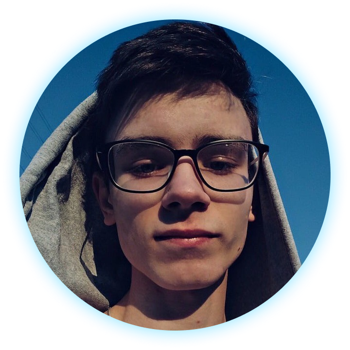
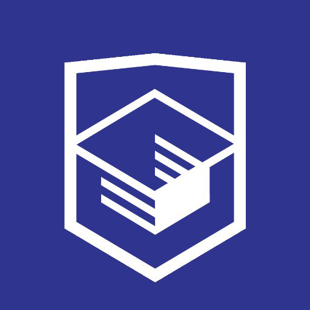
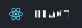
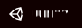
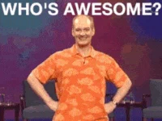
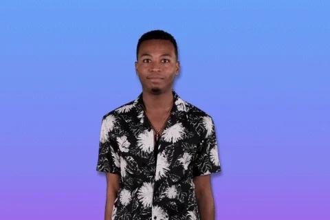

<h1 float="left" align="center"><em>Hi 🖖🏿, I'm Nik Cherednik</em></h1>

## 🧑🏻 About me
<!--  -->

I'm a goal-oriented programmer who loves new start-ups, hard challenges, and tries to create my team. Popcorn, Soda, and Netflix!

<h4 align="center">Get in Touch:</h4>

  
  
  
  

## 🖋 Latest Blog Posts
- [Young Programmer Story. Part I](https://kolyandev.medium.com/young-programmer-story-part-one-75eace79ffdf)

<!--
## Education 🎓
### High School (2019 - 2021)
## Certificates/Awards 📄
## 🗻 Experience
### [Practicum by Yandex](https://practicum.yandex.com) (June 2020 - Present)
- <b>Position: </b>Content Manager of Front-End Programme
- <b>Experience: </b>10 months
- 

  
<b>Description</b>

  to be continued

### [HTML Academy](https://htmlacademy.ru) (January 2020 - October 2020)
- <b>Position: </b>Middle Front-End Mentor
- <b>Experience: </b>10 months
- 

  
<b>Description</b>

  to be continued

### Freelance (December 2017 - January 2020)
- <b>Position: </b>Junior Front-End Developer
- <b>Experience: </b>2 years 2 months
- 

  
<b>Description</b>

  to be continued

## 🎯 Hard Skills
### Languages & Tools
      
    
   
### Softwares
    
  
### Principles & Concepts
**BEM 🥚 OOP 🥚 DRY 🥚 SOLID**
## 🥋 Soft Skills
📆 Time Management 🏅 Good Listener & Word-Player 🥅 Experienced Team-Player  
🗽 High-Motivated 🏰 Goal-Oriented 🔋 Capable Employee 🔢 Mathematics
## ⏩ I'm Currently...
- Learning C#/C++
- Learning and practicing new principles, concepts, like SOLID, DRY, Unit-Tests, on pet projects...
- ...Or problem solving on platforms like Codewars, HackerRank
- Playing games sometimes
- Working on my portfolio
- Doing sport
- Contributing another open-source project
- Ending a High School in Russia
- Learning English
- Dreaming about living and working in the US or Europe
- **Looking for a good job opportunity 😉**
-->

## [🏗 My Works](https://github.com/kolyandev/MyWorks)
*Or keep exploring my profile!*
*Maybe you'll find something interesting for ya!*

  

---

  
  

